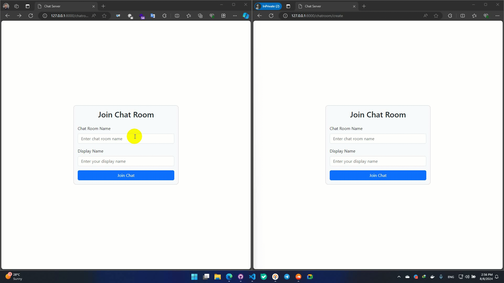

<div align="center">
<h1 align="center">Django Channel 4 Template</h1>
<h3 align="center">Sample project for a chatroom application as demo</h3>
</div>
<p align="center">
<a href="https://www.python.org" target="_blank">  </a>
<a href="https://www.docker.com/" target="_blank">  </a>
<a href="https://www.postgresql.org" target="_blank">  </a>
<a href="https://git-scm.com/" target="_blank">  </a>
<a href="https://git-scm.com/" target="_blank">  </a>
</p>

# Guideline
- [Guideline](#guideline)
- [Demo](#demo)
- [Channels](#channels)
- [Daphne](#daphne)
- [Development usage](#development-usage)
  - [docker-compose](#docker-compose)
- [Production Usage](#production-usage)
  - [Dockerfile content:](#dockerfile-content)
  - [Entry Point](#entry-point)
- [License](#license)
- [Bugs](#bugs)


# Demo
Simplest way possible to create a chat room.


# Channels

Django Channels is an extension to the Django web framework that enables handling of WebSockets, long-running tasks, and other asynchronous features. It allows Django to handle real-time applications, which require WebSocket connections or background task processing.

Key features of Django Channels include:

1. WebSockets: Allows Django to support WebSockets, enabling real-time features like live chat, notifications, or live updates.

2. Asynchronous Tasks: Enables handling of asynchronous tasks, such as background processing or delayed tasks.

3. HTTP/2 Support: Channels can handle HTTP/2 requests, allowing for more efficient connections and multiplexing of multiple requests over a single connection.

4. Channel Layers: Provides an abstraction for communication between different parts of your Django application, which can be useful for sending messages between different consumers.

5. Consumers: These are the main components in Channels for handling different types of connections. There are two main types of consumers:

- WebSocketConsumer for WebSocket connections.
- AsyncWebSocketConsumer for asynchronous WebSocket handling.
6. Routing: Similar to Django’s URL routing, but for WebSocket connections and other protocols.

# Daphne
Daphne is an HTTP, HTTP2, and WebSocket protocol server for ASGI and ASGI-HTTP, developed as part of the Django Channels project. It serves as a server interface for ASGI applications, handling the actual protocol-level details of the web connections and translating them into ASGI-compatible events.

Key features of Daphne include:

1. ASGI Support: Daphne is designed to serve ASGI applications, making it compatible with Django Channels and other ASGI-based frameworks.

2. Protocol Support: Daphne can handle HTTP, HTTP/2, and WebSocket connections, allowing for a wide range of real-time and asynchronous web applications.

3. Concurrency: Daphne is built to handle many connections simultaneously, making it suitable for real-time applications with multiple users connected at the same time.

4. SSL/TLS Support: Daphne can be configured to use SSL/TLS, allowing for secure HTTPS and WSS connections.


# Development usage

This project is based on docker and having docker installed is a must. After installation all you have to do is to run the command bellow to startup the project.
```
docker-compose up --build
```
after building and running the project you need to set the migrations, by using the following command you will create an interactive command line to inside the container.
```
docker-compose exec -it backend bash
```
next you can run the necessary commands for anything like makemigrations and migrate:

```
root@ecb9309e358d:/usr/src/app# python manage.py migrate
```
## docker-compose 
the following manifest shows you the services i have used for my application to run specially database and redis as the channel backend which you can change according to your needs.

```
services:

  redis:
    container_name: redis
    image: redis
    restart: always
    expose:
      - "6379"
    command: redis-server --save 60 1 --loglevel warning

  db:
    container_name: db
    image: postgres:15-alpine
    volumes:
      - ./postgre/data:/var/lib/postgresql/data
    environment:
      - POSTGRES_DB=postgres
      - POSTGRES_USER=postgres
      - POSTGRES_PASSWORD=postgres
    restart: always
    
    healthcheck:
      test: ['CMD-SHELL', 'pg_isready -U postgres']
      interval: 10s
      timeout: 5s
      retries: 5

  backend:
    build:
      context: .
      dockerfile: dockerfiles/dev/django/Dockerfile
    container_name: backend
    command: sh -c "python manage.py runserver 0.0.0.0:8000"
    volumes:
      - ./core:/usr/src/app
    ports:
      - "8000:8000"
    environment:
      - SECRET_KEY=test
      - DEBUG=True
    restart: always

    depends_on:
      - db

  smtp4dev:
    image: rnwood/smtp4dev:v3
    restart: always
    ports:
      # Change the number before : to the port the web interface should be accessible on
      - '5000:80'
      # Change the number before : to the port the SMTP server should be accessible on
      - '25:25'
      # Change the number before : to the port the IMAP server should be accessible on
      - '143:143'
    volumes:
      # This is where smtp4dev stores the database..
      - smtp4dev-data:/smtp4dev
    environment:
      - ServerOptions__HostName=smtp4dev

volumes:
  smtp4dev-data:
```

# Production Usage

In case you want to deploy the application in any platform which supports docker i have created a docker file and entrypoint for running the whole application in docker but keep in mind you have to set other services such as redis and environments of the project too.

## Dockerfile content:

```
FROM python:3.10-slim-buster

LABEL maintainer="bigdeli.ali3@gmail.com"

ENV PYTHONUNBUFFERED=1

WORKDIR /usr/src/app


COPY ./requirements.txt .
RUN pip3 install   --upgrade pip && \
    pip3 install   -r requirements.txt 

COPY ./core/ .

# Copy entrypoint script
COPY ./dockerfiles/prod/django/entrypoint.sh .

# Give execute permission to the entrypoint script
RUN chmod +x ./entrypoint.sh

# Set entrypoint to the script
ENTRYPOINT ["./entrypoint.sh"]

```

## Entry Point

```
#!/bin/sh

# Apply database migrations
echo "Applying database migrations..."
python manage.py migrate

# Collect static files
echo "Collecting static files..."
python manage.py collectstatic --noinput


# Start the server or any other command passed as argument
# echo "Starting server..."
# gunicorn --bind 0.0.0.0:8000 core.wsgi


# echo "Starting ASGI server..."
# python -m gunicorn --bind 0.0.0.0:8000  core.asgi:application -k uvicorn.workers.UvicornWorker 

echo "Starting ASGI server..."
daphne -b 0.0.0.0 -p 8000 core.asgi:application
```

# License
MIT.

# Bugs
Feel free to let me know if something needs to be fixed. or even any features seems to be needed in this repo.